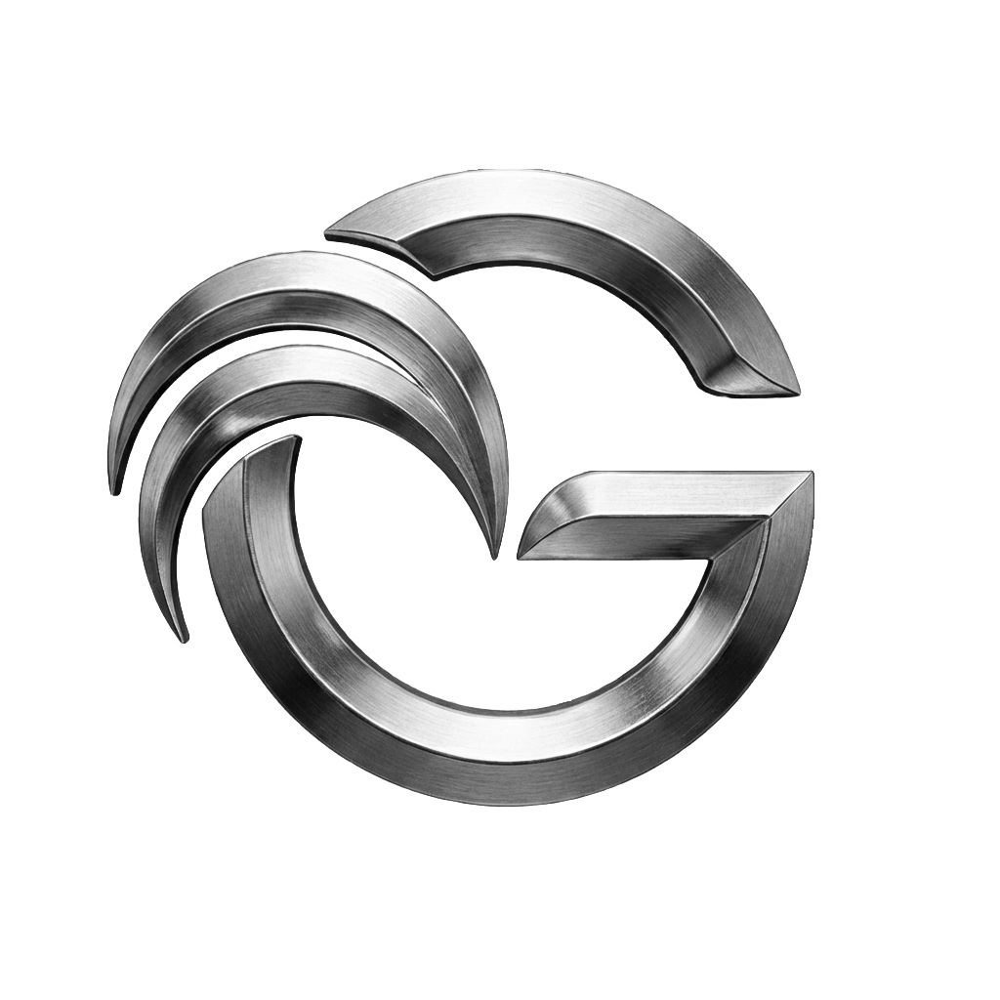

  
  <h1>Gallo</h1>

Gallo is a multi-platform system composed of a backend REST API and an Android mobile client. All components communicate through a secure REST interface.
The backend is built with Spring Boot and uses MariaDB, while both frontend clients consume the API.

<!--Gallo is a multi-platform system composed of a backend REST API, a JavaFX desktop application,
and an Android mobile client. All components communicate through a secure REST interface.
The backend is built with Spring Boot and uses MariaDB, while both frontend clients consume the API.
-->

## Technologies/Features
### [Backend] 
- Spring Boot
- Spring Security(JWT)
- Spring Data JPA(Hibernate)
- MariaDB
- Maven
- Swagger 
- H2 Database
- JUnit
- Mockito
- AssertJ

<!-- ### [Desktop Client]
- JavaFX  
- Maven
- Retrofit  
- TestFX
- Mockito
- JUnit
- AssertJ-->

### [Android Client]
- Android SDK  
- Gradle
- Jetpack Components
- Retrofit  
- Dagger Hilt
- Coil Compose
- Lottie Compose
- JUnit
- Mockito
- AssertJ

## My workflow

Activity diagram

## Database ER

ER

## Template docs
- [Requirements](https://drive.google.com/file/d/1diq_zjKFh7muv0KoUWesED698ZbEQZOE/view?usp=sharing)

[Backend]: https://github.com/CrhistianMRe/gallo-backend
[Desktop Client]: https://github.com/CrhistianMRe/gallo-desktop
[Android Client]: https://github.com/CrhistianMRe/gallo-android
[Workflow(Activity Diagram)]: https://drive.google.com/file/d/1L7UbmsDkHxn08zls8QkCsRoNf7n09437/view?usp=sharing

